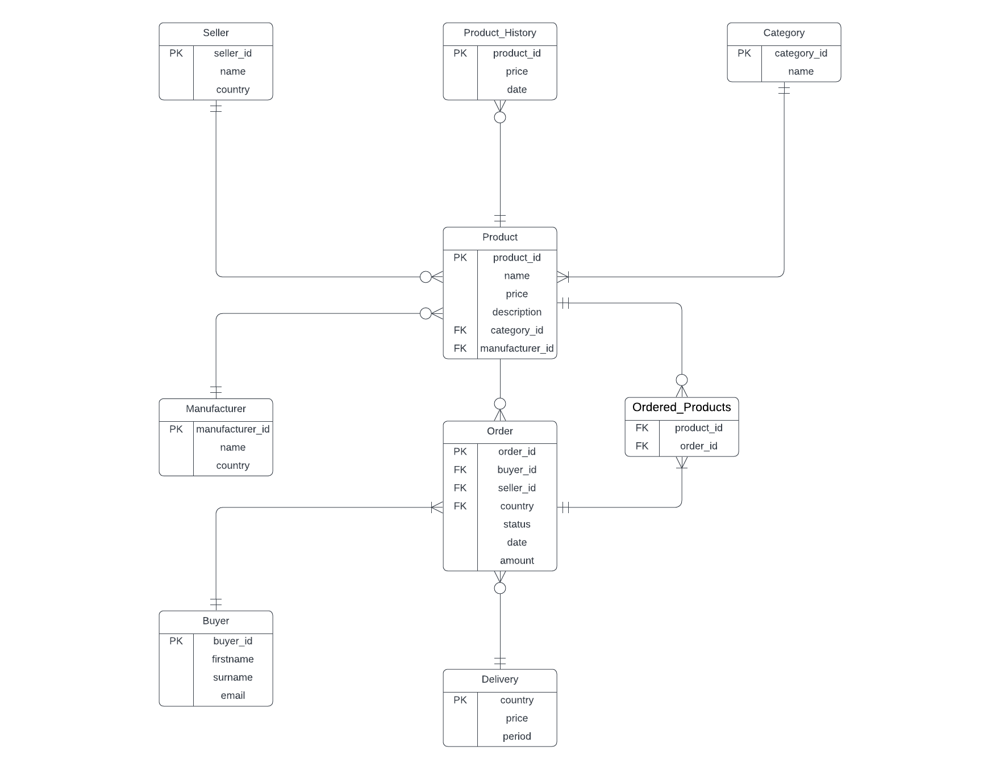
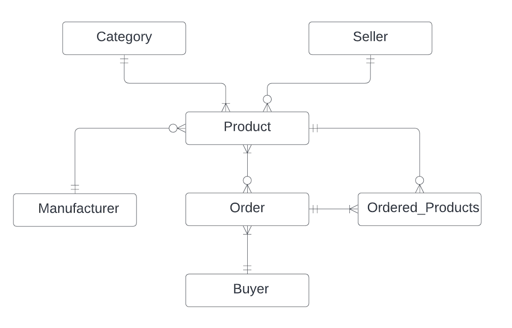
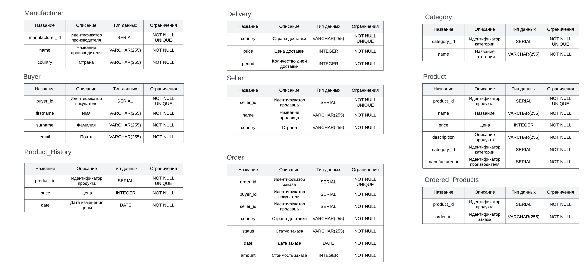

# Проект по курсу "Базы данных"
## Таблицы
1. Product - хранит в себе информацию о продукте, его название, цену, описание и информацию, связанную с категорией и производителем.
2. Manufacturer - отвечает за информацию о производителях (местоположение, название).
3. Buyer - хранит информацию о покупателях, фамилию, имя и email.
4. Seller - список продавцов с названиями и странами.
5. Delivery - описывает стоимость и скорость доставки, до определеных стран.
6. Category - описывает категории, доступные для заказа.
7. Product History - хранит историю изменения цкн товаров.
8. OrderedProducts - таблица связка между товарами и заказами.
9. Order - информация о заказах.

## Модели

## Концептуальная

## Логическая

## Физическая

## Создание и заполнение БД
Выбранная СУБД - PostgreSQL

Прежде всего используем Data Definition Language: с помощью [create-запросов](scripts/ddl.sql)
мы создаём и описываем отношения,
которые присутствуют в базе данных.

Далее воспользуемся Data Manipulation Language.
На этом шаге с помощью [insert-запросов](scripts/inserts.sql) описанные
выше отношения заполняются данными,
чтобы в дальнейшем с ними можно было работать.

## Работа с Базой Данных
* [Создание select-запросов](scripts/selects)
* [Создание представлений(view)](scripts/views)
* [Создание индексов](scripts/index.sql)
* [Создание триггеров](scripts/triggers.sql)

## [CRUD](scripts/crud.sql)
CRUD — акроним, обозначающий четыре базовые функции, используемые при работе с базами данных: создание (create), чтение (read), модификация (update), удаление (delete). Введён Джеймсом Мартином в 1983 году как стандартная классификация функций по манипуляции данными

## Версионирование
Цена на продукты могут изменяться с течением времени, поэтому
храним в основной таблице(Product) только актуальные данные и историю изменений в отдельной таблице(Product_History). Основная таблица всегда перезаписывается текущими данными
с перенесением старых данных в другую таблицу.
Версионность достигается путём использования SCD 4

